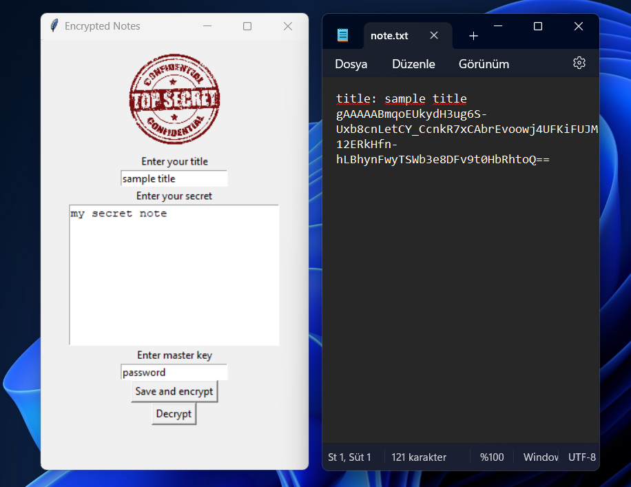

# Tkinter Encryption App

This is a simple GUI application using Tkinter for encrypting and decrypting text messages. The encryption is performed using the `cryptography` library, and the encrypted messages are saved to a file.

## Features

- Encrypt text messages with a master key.
- Save encrypted messages to a file.
- Decrypt messages from the file using the correct master key.
- Simple GUI using Tkinter.

## Screenshot



## Requirements

- Python 3.x
- Tkinter
- cryptography

## Installation

1. Clone the repository or download the source code.
2. Install the required Python packages using pip:

   ```bash
   pip install cryptography
   ```

## Usage

1. Run the `main.py` script:

   ```bash
   python main.py
   ```

2. The GUI will appear with fields to enter a title, secret message, and master key.

3. To encrypt and save the message:
   - Enter the title.
   - Enter the secret message.
   - Enter the master key.
   - Click the "Save and encrypt" button.

4. To decrypt a message:
   - Enter the title of the message to decrypt.
   - Enter the master key used for encryption.
   - Click the "Decrypt" button.
   - The decrypted message will appear in the secret message field.

## File Structure

- `main.py`: The main script containing the Tkinter GUI and encryption/decryption logic.
- `note.txt`: The file where encrypted messages are saved.

## Security Considerations

- Ensure the master key is strong and kept secure. The security of the encryption depends on the strength of the master key.
- The `note.txt` file should be kept in a secure location, as it contains the encrypted messages.

## License

This project is licensed under the MIT License. See the [LICENSE](LICENSE) file for details.

## Acknowledgments

- [Tkinter](https://docs.python.org/3/library/tkinter.html) - Python's standard GUI library.
- [cryptography](https://cryptography.io/en/latest/) - The cryptography library for encryption and decryption.
```